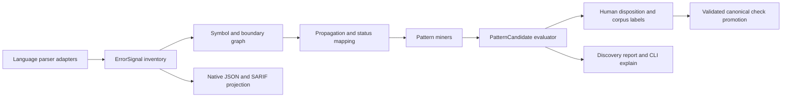

# AIRA Proactive Detection Code Review and Implementation Plan

**Review date:** 2026-07-16  
**Reviewed commit:** `c8a14bf7cf5f96217712195aba4866849dde2334` (`main`)  
**Scope:** CLI scanner and checkers, finding metadata, static-vs-model comparison, research schemas, provider routing, deterministic API, browser fallback, tests, packaging, and the path from the fixed C01-C15 taxonomy to discovery of previously unlisted error patterns.  
**Posture:** Review plus implementation roadmap. Phases 0-2 are implemented in the current working tree; Phase 3 remains gated behind calibration-oriented candidate design.

## Executive conclusion

AIRA already has the right first foundation for location-aware work: findings carry file/line context, boundary types, evidence, and three fingerprints, and `aira compare` creates a static-vs-model suppression matrix. The next useful product is not simply more regex checks. It is an **error-signal inventory plus repository-level pattern evaluator** that can observe exceptions, error codes, status mappings, sentinel returns, logging, retries, side effects, and propagation outcomes at exact code locations, then identify contradictions, clusters, and outliers for review.

Before that expansion, AIRA has several evidence-integrity defects that can distort current research results. Most importantly:

1. one model finding can currently match more than one static finding, including across different files;
2. parser failures and partial scans can still produce `PASS` statuses and count files as scanned;
3. browser fallback pre-marks most checks as evaluated and converts them to `PASS`, even though it is the weakest engine;
4. several static rules count lexical tokens rather than program behavior, producing duplicates and clear false positives;
5. the test suite and documented development install are not currently green or reproducible.

The recommended sequence is therefore:

1. restore measurement integrity;
2. introduce a versioned `ErrorSignal` intermediate representation;
3. build a location/symbol/error-propagation graph;
4. mine new patterns as non-scoring candidates;
5. calibrate candidates against labeled and mutation corpora;
6. promote only validated candidates into future canonical checks and a new scoring version.

## Review method and evidence

The review included:

- architecture inventory of 45 tracked source files across Python, JavaScript, Ruby, and shell;
- direct review of scanner, checkers, comparison, metadata, CLI, research, API, provider, browser fallback, and test code;
- a full self-scan of the repository using AIRA;
- focused and full test attempts;
- adversarial probes for malformed code, supervised tasks, error-shaped return dictionaries, TypeScript parser coverage, C14 counting, comparison cardinality, path containment, and boundary classification;
- wheel construction and package-content inspection;
- current primary documentation review for error-tolerant parsing, standard static-analysis locations, and normalized error types.

### Verification snapshot

| Verification | Result |
|---|---|
| `python3 -m pytest tests -q` | Collection blocked: `ModuleNotFoundError: hypothesis` |
| Focused runnable suites | 51 passed, 1 skipped, 4 subtests passed, 4 failed |
| Focused failures | Groq default-model regression; 3 research tests mock stale import paths and two attempted live network access |
| Wheel build | Passed; `aira_scanner-1.3.0-py3-none-any.whl` built |
| Wheel contents | Included an unintended `aira/.DS_Store` |
| AIRA self-scan | 44 files, 85 findings: 38 high, 43 medium, 4 low |
| Self-scan concentration | 24 C03, 19 C13, 11 C09, 8 C14; 32 findings classified at exception-handler boundaries |

The self-scan is not treated as ground truth. It was useful because it revealed repeated false positives in regex literals, test fixtures, comments, parser-fallback handlers, and intentionally handled health checks.

## Code review findings

### P0 — Static/model comparison can overstate matches and understate model misses

**Locations:** `CLI/aira/comparison.py:96-123`, `CLI/aira/comparison.py:156-204`, `CLI/aira/finding_metadata.py:278-293`

`build_suppression_matrix()` records used model indexes, but it never removes them from later match candidates. Multiple static findings can therefore match the same model finding. In addition, semantic fingerprints omit file and line, so identical snippets in different files can match before the same-file checks run. `_same_file()` also falls back to basename equality, allowing `src/a/index.py` and `src/b/index.py` to be treated as the same artifact.

**Reproduction:** two static findings and one model finding produced `matched_by_model=2`, `missed_by_model=0`; the cross-file semantic fingerprints were identical.

**Impact:** suppression matrices, miss rates, per-boundary recall, and model comparisons can be materially optimistic. This is a research-integrity blocker for location-aware studies.

**Required correction:** enforce one-to-one matching; require canonical repository-relative artifact identity before any semantic match; eliminate basename fallback; version fingerprints; add match invariants such as `matched_by_model <= model_findings`.

### P0 — Scanner/parser failures still yield 13 `PASS` checks

**Locations:** `CLI/aira/scanner.py:165-171`, `CLI/aira/scanner.py:320-350`, `CLI/aira/scanner.py:352-393`, `CLI/tests/test_scanner_modes.py:36-46`

The default status for every automatable check is `PASS` whenever `files_scanned > 0`. A malformed Python file returns a high-severity `SCANNER` finding but also returns `scanned=1`. Because `SCANNER` is not a C-code, none of the check statuses is changed to `FAIL` or `UNKNOWN`.

**Reproduction:** a file containing `def broken(:` produced one high `SCANNER` finding, `files_scanned=1`, `checks_passed=13`, and only C07/C12 as `UNKNOWN`.

**Impact:** structured JSON can simultaneously say the scan is unreliable and that all automatable checks passed. Downstream consumers that read the check matrix but not findings will overclaim coverage.

**Required correction:** track `files_discovered`, `files_analyzed`, `files_partial`, and `files_failed` separately. A parser or read failure must make every affected rule `UNKNOWN` for that artifact; aggregate status is `PASS` only when every in-scope artifact was analyzed by an engine capable of evaluating that rule.

### P1 — Browser fallback converts a weak scan into broad `PASS` claims

**Locations:** `index.html:934-948`, `index.html:1062-1082`, `index.html:1085-1097`, `index.html:1304-1324`

The browser fallback initializes `evaluated` with eleven checks, then converts every still-unknown evaluated check to `PASS`. It does this regardless of whether the source contains the construct needed to evaluate that check. When the deterministic server scan fails, the UI also displays the fallback toast with a success style. Browser findings omit file paths, so multi-file repository fallback results lose the location data needed by the proposed study.

**Impact:** the weakest engine produces the broadest-looking PASS matrix, while an upstream deterministic failure is presented as a successful fallback. This contradicts AIRA's core question about truthful failure behavior.

**Required correction:** browser fallback should emit `UNKNOWN` unless a specific rule was actually evaluated with sufficient coverage; include explicit `scan_completeness=partial`, upstream failure reason, per-rule capability, source-file attribution, and a warning—not success—presentation.

### P1 — Current structural rules generate duplicates and obvious false positives

**Locations:** `CLI/aira/checkers/python_checker.py:120-143`, `CLI/aira/checkers/python_checker.py:222-238`, `CLI/aira/checkers/python_checker.py:318-418`, `CLI/aira/checkers/js_checker.py:56-75`

Examples reproduced during review:

- `return {"status": "error", "success": False}` inside an exception handler generated two C01 findings. The rule checks only recognized keys, not their values, and emits once per matching key.
- an assigned and awaited `create_task()` generated C08 even though the comment says assignment/awaiting is a supervision signal; the implementation has no parent/control-flow check.
- self-scan findings were triggered by regex definitions, string fixtures, and a C15 comment because several lexical checks do not tokenize away strings/comments before deciding that a trigger exists.
- Python C03 classifies every expression-only handler as “only logs,” even when the expression is cleanup, metrics, or another operation.

**Impact:** counts are not stable units of defects, duplicate findings inflate per-check totals, and rule implementations can flag their own vocabularies.

**Required correction:** make findings one per structural event, inspect return values and task ownership, use parser/token context before regex fallback, carry counterevidence, and deduplicate on a structural event ID rather than description text.

### P1 — C14 measures matching lines, not test cases or failure branches

**Locations:** `CLI/aira/checkers/test_coverage_checker.py:17-43`, `CLI/aira/checkers/test_coverage_checker.py:60-100`

C14 increments counts for each matching line. One test function with three assertions was reported as three total happy-path tests. Generic tests default to happy-path, and the resulting finding states that “AI-generated test suites systematically under-cover failure branches” even though the scanner has no authorship evidence and does not map tests to production error branches.

**Impact:** ratios are not test-case ratios or coverage ratios; severity and research language overstate what was measured. Findings always point to line 1, weakening location-aware analysis.

**Required correction:** parse test cases, assign each test exactly once, map mocks/raises/status assertions to error branches or target symbols where possible, report `unclassified` separately, and change the claim to observed test-surface asymmetry.

### P1 — JavaScript/TypeScript parser capability is silent while results default to PASS

**Locations:** `CLI/aira/checkers/js_checker.py:13-54`, `CLI/aira/checkers/js_checker.py:56-75`, `CLI/aira/scanner.py:352-378`, `CLI/aira/deterministic_scan.py:50-80`

`esprima` is optional and is not in package dependencies. TypeScript syntax commonly fails esprima parsing, after which the checker silently runs lexical rules. The per-file parser result is not returned to `AIRAScanner`, and the aggregate static metadata does not report parser coverage.

**Reproduction:** a valid TypeScript file containing an interface had `parse_ok=False`, zero findings, `files_scanned=1`, and 13 PASS checks.

**Impact:** “no finding” is indistinguishable from “rule did not structurally evaluate this syntax.” This will pollute cross-language and cross-model comparisons.

**Required correction:** emit per-artifact parser/capability records; use `UNKNOWN` for unsupported rule-language combinations; adopt a pinned, error-tolerant JS/TS parser before cross-location mining.

### P1 — LLM coverage and attribution are not trustworthy enough for location studies

**Locations:** `CLI/aira/scanner.py:488-523`, `CLI/aira/scanner.py:571-629`, `CLI/aira/scanner.py:395-409`

When an LLM input budget ends mid-file, that partial file is counted as scanned. Omitted files are not listed, and check defaults remain PASS unless the model overrides them. Model-provided file paths are also accepted without containment or membership validation; relative `..` paths and existing absolute paths can be resolved and read during finding enrichment.

**Impact:** model coverage can look complete when it is partial, path hallucinations can corrupt context/fingerprints, and untrusted provider output can direct local file reads outside the scan target.

**Required correction:** validate every model path against the exact manifest sent to the model; reject absolute/traversing paths; report full/partial/omitted artifact manifests; never treat a partial artifact as scanned; mark unsupported/omitted checks UNKNOWN.

### P1 — The development and test contract is currently broken

**Locations:** `CLI/pyproject.toml`, `.github/workflows/ci.yml:20-26`, `CLI/tests/test_llm_routing.py`, `CLI/tests/test_research.py`

The workflow installs `.[dev]`, but `CLI/pyproject.toml` declares no `dev` optional dependencies. A clean environment therefore does not receive pytest or Hypothesis. The current local full suite stops on missing Hypothesis. Focused suites reveal four additional failures: a real Groq configuration regression and three research tests that patch old package-level symbols after the backend refactor; two of those tests attempted network access to `example.supabase.co`.

**Impact:** changes to evidence and comparison logic cannot be calibrated against a trustworthy green baseline; tests can unexpectedly leave process boundaries.

**Required correction:** declare and lock dev/test dependencies, forbid network in unit tests, patch dependency injection points rather than compatibility re-exports, and make the full Python version matrix a promotion gate.

### P2 — Provider behavior and public documentation have drifted

**Locations:** `CLI/aira/llm.py:54-69`, `CLI/aira/cli.py:385-406`, `lib/llm.js:139-225`, `lib/llm.js:355-388`, `README.md:121-146`, `.env.example:3-4`

Python no longer supplies the documented default Groq model, so an API key alone is not configured. The web routing functions for NVIDIA, Groq, Gemini, and OpenRouter ignore the request's `model` override even though `runLLM()` passes it. Gemini is implemented in the Python router but is absent from the CLI provider choices and current method documentation.

**Impact:** documented configuration and explicit caller intent do not match runtime behavior. This also demonstrates why new error discovery should compare signals across parallel implementations.

**Required correction:** define provider capabilities/configuration once, generate CLI choices and health output from it, and add parity tests across Python and JavaScript routers.

### P2 — The fixed C01-C15 taxonomy is duplicated across too many surfaces

**Locations:** `CLI/aira/scanner.py`, `CLI/aira/finding_metadata.py`, `CLI/aira/research/base.py`, `CLI/aira/research/helpers.py`, `lib/research-schema-v2.js`, `lib/airtable.js`, `index.html`, `SUPABASE_MIGRATION_V2.sql`, docs and prompts

Adding C16 directly would require synchronized changes across scanner registries, prompts, browser labels, Python and JavaScript scoring, SQL seed data, Airtable fields, documentation, and tests. More importantly, adding a new weighted check would silently change score meaning unless the scoring version changes.

**Impact:** the current design discourages experimentation or risks schema/scoring drift.

**Required correction:** keep canonical checks versioned and stable; introduce unweighted discovery candidate types in a separate registry; generate language/UI/research projections from a single checked-in schema; promote candidates only with a new taxonomy/scoring version.

## Current error-handling topology

The codebase contains enough error-handling diversity to justify repository-level analysis:

- 58 production Python exception handlers were observed outside tests and review tooling;
- 18 JavaScript/browser catch sites were observed across the active API, provider, storage, extension, and browser surfaces;
- CLI result signaling uses exit codes 0-3;
- API signaling uses at least 200, 400, 403, 405, 413, and 500;
- the same provider and research workflows have Python and JavaScript implementations;
- the web path has three assurance tiers: provider analysis, deterministic static analysis, and browser heuristic fallback.

This is precisely the setting where single-location rules are insufficient. AIRA needs to compare how the *same conceptual error* is translated at adjacent and parallel boundaries.

## Proposed product boundary

The new system should answer two separate questions:

1. **Canonical audit:** Does this code violate one of the validated C01-C15 checks?
2. **Discovery review:** Do error signals and their locations form a contradiction, cluster, drift pattern, or outlier that merits evaluation even though it is not a current check?

Discovery output must not initially change PASS/FAIL, FTI, exit code 1, or research claims. It should create evidence-rich `PatternCandidate` records with states:

`observed -> candidate -> reviewed -> accepted-idiom | suppressed | promoted-check`

This preserves AIRA's research discipline while making it proactive.

## Target architecture

### 1. Error-signal inventory

Create a language-neutral `ErrorSignal` intermediate representation. Parser adapters should emit observations, not risk conclusions.

Minimum signal kinds:

- exception/catch handler and caught type;
- raise/throw/reject and preserved cause;
- returned error/success object, sentinel, tuple/result type, or status code;
- HTTP/RPC/process error code creation and translation;
- error/warn/fatal log or audit emission;
- retry start, exhaustion, and terminal outcome;
- fallback/default branch;
- async spawn, ownership, await/join/callback, and rejection handling;
- write/commit/charge/publish side effect and transaction/rollback boundary;
- cleanup/finally/defer behavior;
- validation/auth/startup/readiness boundary;
- parser error, missing syntax, or unsupported-rule capability.

Each signal must include a canonical repo-relative artifact URI, start/end line and column, symbol identity, enclosing blocks, error identity, outcome, side effects, parser health, confidence class, and evidence hash.

### 2. Symbol, control-flow, and boundary graph

Build edges that answer where the error came from and what happened next:

- `calls`, `may_raise`, `catches`, `rethrows`, `wraps`, `drops_cause`;
- `returns_status`, `maps_status`, `logs`, `audits`;
- `continues`, `aborts`, `retries`, `falls_back`;
- `writes_before`, `rolls_back`, `commits_after`;
- `spawns`, `awaits`, `joins`, `owns`;
- `parallel_to` for Python/JavaScript or sync/async implementations.

Start intraprocedurally, then add conservative interprocedural edges only when import/call resolution is strong. Every inferred edge needs evidence and a confidence class.

### 3. Pattern miners for previously unlisted risks

Use candidate IDs such as `P001`, not `C16`, until calibration.

| Candidate pattern | Evidence needed | Why location matters |
|---|---|---|
| Error-success contradiction | exception/error log plus success return/status on a reachable path | contradiction may be split across handler and API return |
| Status mapping drift | same error identity maps to different status classes in peer paths | 404/500/200 differences only appear across locations |
| Cause erasure | catch wraps or returns generic error without chaining/type/code | loss occurs at translation boundaries |
| Sibling propagation asymmetry | peer implementations handle the same failure differently | an outlier may be a mistake even when each site looks plausible |
| Swallow cluster | repeated non-propagating handlers at one module/boundary | repetition may establish a systemic policy or anti-pattern |
| Cleanup masking | finally/defer return or cleanup exception replaces the original | requires control-flow order, not keywords |
| Partial side-effect after failure | write occurs before failure and no rollback/idempotency evidence follows | requires side-effect and exception locations |
| Async ownership gap | spawned work has no durable owner/await/result callback | ownership is visible across the surrounding symbol graph |
| Retry exhaustion mis-signaling | retries fail but terminal path returns success/empty/default | requires connecting loop, caught error, and exit status |
| Readiness/health disagreement | startup error is recorded while health/readiness still reports healthy | usually crosses initialization and API locations |
| Error-code shadowing | specific low-level codes collapse into a generic code with no provenance | requires tracking error identity through layers |
| Scanner blind-spot cluster | parser/coverage failures concentrate by language or directory | prevents absence-of-findings from being called PASS |

### 4. Candidate evaluator: mistake, intentional idiom, or pattern

The evaluator should produce a review rationale with both evidence and counterevidence. It should not pretend to know developer intent.

Suggested factors:

- **structural confidence:** parser-backed vs lexical, complete vs partial parse;
- **propagation break:** error converted to success/empty/continue;
- **critical location:** startup, auth, audit, transaction, payment, persistence, health;
- **side-effect exposure:** writes before failure, missing rollback/idempotency;
- **peer inconsistency:** one handler differs from comparable siblings;
- **support:** repeated instances across symbols/files/commits;
- **test evidence:** the specific failure branch has a matching test;
- **intent evidence:** explicit comment, documented result type, compensating action, metric/audit, bounded fallback policy;
- **history:** newly introduced outlier vs stable reviewed convention.

Initial classification policy:

- a **likely local mistake** is a high-confidence contradiction or a strong outlier at one critical boundary;
- a **candidate systemic pattern** requires repeated structural support—default minimum three independent symbols or two layers—unless one instance crosses a critical side-effect boundary;
- an **intentional idiom** requires explicit counterevidence such as a documented contract, typed result, compensating action, or reviewed suppression;
- otherwise the result stays **needs review**.

Do not collapse these factors into a pseudo-probability until calibration data exists. Expose component scores and rationale first.

### 5. Identity and matching v2

Replace current line-heavy/basename-tolerant matching with:

- canonical artifact ID: repository identity plus normalized repo-relative path;
- symbol ID: language, qualified symbol name, and structural signature;
- event ID: signal kind plus symbol, AST/CST path, and normalized statement;
- content fingerprint: normalized evidence, kept separate from identity;
- location record: exact region, allowed to move without changing semantic identity;
- one-to-one deterministic matching within the same artifact/symbol before any broader similarity tier.

Line windows can remain a fallback, but only after artifact identity agrees and unmatched candidates are consumed once.

### 6. Parser strategy

- Keep Python `ast` as the initial structural source for Python.
- Add a pinned Tree-sitter JS/TS adapter as a spike, because its syntax trees expose queryable `ERROR` and `MISSING` nodes rather than silently treating parse failure as full coverage.
- Keep lexical detectors only as labeled fallback signals; they never authorize PASS.
- Record grammar/parser versions in scan metadata for reproducibility.

Tree-sitter's current query documentation explicitly supports querying recovered `ERROR` and `MISSING` nodes: <https://tree-sitter.github.io/tree-sitter/using-parsers/queries/1-syntax.html>.

### 7. Output and interoperability

Keep native AIRA JSON as the authoritative research format. Add:

- `schema_version` and `taxonomy_version`;
- artifact manifest and per-rule capability/coverage;
- signal and candidate arrays separate from canonical findings;
- exact regions and related locations;
- parser/engine provenance;
- disposition records and suppression justification;
- optional SARIF 2.1 export for CI/code-host annotations.

SARIF already defines artifact plus precise region locations, so using it as an output projection avoids inventing a CI interchange format while retaining AIRA-specific graph evidence in native JSON: <https://docs.oasis-open.org/sarif/sarif/v2.1.0/os/sarif-v2.1.0-os.html>.

For a later optional runtime-evidence bridge, normalize observed error identities around stable types/codes rather than raw messages. OpenTelemetry's error conventions recognize both exceptions and error-code failures and standardize `error.type`/`exception.type`: <https://opentelemetry.io/docs/specs/semconv/general/recording-errors/>.

## Implementation phases

### Implementation progress — 2026-07-16

Phases 0-2 are implemented in the current working tree.

Phase 0 — measurement integrity:

- `aira-comparison-v2` enforces exact artifact identity, one-to-one matching, and partition invariants;
- scan results distinguish discovered, analyzed, partial, failed, and omitted artifacts, and unevaluated coverage cannot produce PASS;
- model finding paths are constrained to the exact sent artifact manifest;
- C01 is value-aware and deduplicated, C08 recognizes owned/awaited work, and C14 counts parsed test cases once with an unclassified bucket;
- lexical checks remove comments, strings, and regex literals before matching;
- browser fallback is partial, location-aware, warning-styled, and cannot synthesize PASS;
- Python unit tests deny unmocked network access, provider overrides are parity-tested, and the development dependency contract is reproducible;
- a versioned `aira-measurement-baseline-v1` fixture locks the corrected C01/C08 behavior;
- wheel packaging excludes `.DS_Store` and includes the versioned schemas.

Phase 1 — ErrorSignal inventory:

- `aira-error-signal-v1` and `aira-error-inventory-v1` record exact regions, stable structural IDs, symbol/block identity, outcomes, error identity, side effects, parser health, confidence, and evidence hashes;
- Python uses AST; JavaScript/TypeScript/JSX/TSX use pinned Tree-sitter grammars with explicit recovery diagnostics and a labeled lexical fallback;
- `aira inventory-errors` and `aira scan --include-signal-inventory` expose the non-scoring layer;
- metamorphic fixtures confirm signal identity survives whitespace and line shifts;
- canonical checks, FTI, and exit thresholds remain unchanged.

Phase 2 — deterministic error-flow graph:

- `aira-error-graph-v1` connects containment, ordering, catch/rethrow/wrap/cause loss, status returns, logging, retries, fallbacks, async operations, side-effect ordering, and conservative call resolution;
- ambiguous, external, builtin, and dynamic calls remain explicit `unresolved_call` nodes;
- every edge carries source evidence and graph invariants require valid endpoints;
- `aira error-graph` and `aira scan --include-error-graph` expose the graph without changing canonical results;
- deterministic Python and TypeScript fixtures cover the Phase 2 exit gate.

Verification:

- Python 3.9, 3.10, 3.11, and 3.12: 116 passed, 1 skipped on each runtime (9 subtests where supported);
- web provider contract suite: 4 passed;
- AIRA self-inventory: 51 artifacts analyzed, 0 partial/failed, 929 signals;
- AIRA self-graph: 5,196 nodes, 6,486 evidence-backed edges, 0 indexing diagnostics;
- wheel build: required signal/graph modules and schemas present, no `.DS_Store` entries.

### Phase 0 — Restore evidence integrity

**Status:** Complete in the current working tree.

**Goal:** make current C01-C15 results trustworthy enough to serve as a baseline.

Work:

- fix one-to-one, path-safe comparison and add invariants;
- make parse/read/partial failures produce UNKNOWN capability, not PASS;
- separate discovered/analyzed/partial/failed artifact counts;
- validate model file paths against the sent manifest;
- make C01 value-aware and structurally deduplicated;
- recognize assigned/awaited/task-group supervision for C08;
- replace C14 line counts with parsed test-case classification;
- stop lexical rules from triggering on comments/string fixtures where structure is available;
- make browser fallback honest about capability and locations;
- restore dev dependencies, eliminate unit-test network, and get the full version matrix green;
- restore provider configuration parity and tests.

Exit gates:

- all current tests pass on Python 3.9-3.12;
- no unit test can access the network;
- comparison invariants hold on adversarial duplicate-path corpora;
- malformed/unsupported/partial inputs cannot produce PASS for unevaluated rules;
- baseline scan fixtures are versioned before rule-count changes.

### Phase 1 — Add the signal IR and parser capability ledger

**Status:** Complete in the current working tree.

**Goal:** collect errors, codes, outcomes, and exact locations without classifying them as defects.

Suggested modules:

- `CLI/aira/signals.py`
- `CLI/aira/parsers/base.py`
- `CLI/aira/parsers/python_signals.py`
- `CLI/aira/parsers/js_ts_signals.py`
- `CLI/aira/parser_health.py`
- `CLI/aira/schemas/error-signal-v1.json`

CLI/API surface:

- `aira inventory-errors TARGET --output json`
- `aira scan TARGET --include-signal-inventory`

Exit gates:

- stable signal output under whitespace-only and line-shift mutations;
- exact artifact/region identity;
- explicit parser error/missing/unsupported records;
- no change to FTI or canonical exit thresholds.

### Phase 2 — Build the error-flow graph

**Status:** Complete in the current working tree.

**Goal:** connect signals within functions and across confidently resolved calls.

Suggested modules:

- `CLI/aira/error_graph.py`
- `CLI/aira/symbol_index.py`
- `CLI/aira/status_mapping.py`
- `CLI/aira/side_effects.py`

Start with Python intraprocedural flow and JS/TS structural flow. Add interprocedural resolution incrementally and preserve unknown edges rather than guessing.

Exit gates:

- graph fixtures cover return, raise, catch, wrap, log, retry, fallback, and side-effect paths;
- every edge points to source evidence;
- unresolved calls remain explicit;
- graph generation is deterministic.

### Phase 3 — Add pattern discovery and explanation

**Status:** Next phase; not started by this implementation sequence.

**Goal:** produce review candidates from cross-location relationships.

Suggested modules:

- `CLI/aira/patterns/base.py`
- `CLI/aira/patterns/contradictions.py`
- `CLI/aira/patterns/propagation_drift.py`
- `CLI/aira/patterns/status_drift.py`
- `CLI/aira/patterns/side_effect_gaps.py`
- `CLI/aira/candidates.py`

CLI/API surface:

- `aira discover TARGET --min-support 3`
- `aira explain-candidate RESULT.json P001`
- `aira compare --candidates BASE.json HEAD.json`

Exit gates:

- candidates contain member locations, peer group, rationale, counterevidence, and confidence class;
- candidate output cannot fail canonical checks or alter FTI;
- each miner has positive, negative, near-miss, and intentional-idiom fixtures.

### Phase 4 — Calibration corpus and human disposition loop

**Goal:** determine which candidates deserve promotion.

Build:

- hand-labeled real examples with reviewer agreement;
- mutation operators for swallowed exceptions, status flips, cause erasure, missing awaits, retry terminal changes, rollback deletion, and readiness drift;
- clean intentional idioms such as cache misses, optional imports, feature detection, bounded retries, and best-effort telemetry;
- disposition storage with reviewer, rationale, tool/taxonomy version, and expiration/re-review policy.

Initial gates:

- deterministic canonical findings target at least 95% precision on the labeled validation set;
- high-confidence discovery candidates target at least 85% precision before promotion;
- every promoted pattern shows measurable recall gain on held-out mutations without a material regression in clean idioms;
- two reviewers agree on promotion examples or disagreements are documented.

### Phase 5 — Versioned promotion into canonical checks

**Goal:** add only evidence-supported checks without corrupting historical scores.

Work:

- create a single canonical taxonomy registry;
- generate Python, JavaScript, prompt, UI, research, and SQL projections;
- introduce `taxonomy_version` and a new scoring version when weights change;
- retain old score computation for historical records;
- publish check definition, evidence, calibration results, known limitations, and migration notes.

## Test plan

### Required regression tests from this review

1. one model finding cannot match two static findings;
2. identical basenames in different directories never match by location;
3. identical snippets in different files do not semantic-match without artifact agreement;
4. malformed Python yields parser failure, zero fully analyzed files, and UNKNOWN affected checks;
5. valid TypeScript with unsupported parser capability does not produce broad PASS;
6. `{"status": "error", "success": false}` is not C01 and generates no duplicates;
7. assigned-and-awaited task is not C08; discarded task is;
8. one test function with three assertions counts as one test case;
9. lexical rule definitions and string fixtures do not trigger production findings;
10. browser fallback cannot turn unevaluated checks into PASS;
11. model paths outside the scan manifest are rejected;
12. truncated LLM input lists full, partial, and omitted artifacts and marks coverage UNKNOWN;
13. provider model overrides are honored on every routed provider;
14. Groq API-key-only configuration matches the documented default;
15. unit tests fail if they attempt network access.

### Discovery-engine tests

- golden signal inventories for Python and JS/TS;
- control-flow fixtures for conditional rethrow and mixed swallow branches;
- parallel implementation fixtures with one intentional and one accidental deviation;
- metamorphic tests for whitespace, comments, line shifts, file order, and renamed local variables;
- property tests for graph/matching invariants;
- snapshot tests for schema/taxonomy versions;
- corpus tests separating production code, tests, generated files, rule definitions, and examples;
- performance budgets by files, lines, signals, and graph edges.

## Recommended first milestone

Do not begin with C16. Deliver a **Measurement Integrity + Error Inventory v1** milestone:

1. close the two P0 findings;
2. make capability and completeness explicit;
3. repair the most measurable false positives (C01, C08, C14);
4. add `ErrorSignal` for exception handlers, raises/throws, status codes, returns, logs, retries, and side effects;
5. expose `aira inventory-errors` with exact location/provenance;
6. run it against AIRA itself and one labeled external corpus;
7. use the resulting data to select the first two candidate miners—recommended: error-success contradiction and sibling propagation asymmetry.

That milestone changes AIRA from a fixed reactionary rule list into a system that can observe new error behavior safely, while preserving the credibility of existing research outputs.

## Files most likely to change during implementation

| Area | Existing files | New/changed responsibility |
|---|---|---|
| Scan truth/status | `CLI/aira/scanner.py`, `CLI/aira/deterministic_scan.py` | artifact manifest, capability, completeness, signal attachment |
| Python extraction | `CLI/aira/checkers/python_checker.py` | consume signal IR for canonical rules |
| JS/TS extraction | `CLI/aira/checkers/js_checker.py` | parser adapter and labeled lexical fallback |
| Identity/location | `CLI/aira/finding_metadata.py` | fingerprint v2, exact regions, canonical artifacts |
| Comparison | `CLI/aira/comparison.py` | one-to-one matching and candidate diff |
| Test analysis | `CLI/aira/checkers/test_coverage_checker.py` | parsed test cases and branch linkage |
| CLI | `CLI/aira/cli.py` | inventory/discover/explain surfaces |
| Browser/API | `index.html`, `api/static-scan.py` | truthful capability/completeness and candidate rendering |
| Research | `CLI/aira/research/*`, `lib/research-schema-v2.js`, SQL | versioned taxonomy; candidate records separate from FTI |
| Tests | `CLI/tests/*` plus new corpus fixtures | calibration, invariants, negative/idiom cases |

## Final recommendation

AIRA should become proactive by **discovering relationships among error signals**, not by making its regex vocabulary longer. The durable differentiator is the ability to say:

> “These five handlers catch the same failure at the same kind of boundary; four preserve error semantics, one returns success, and the outlier is untested.”

That is materially more useful than another isolated keyword finding, and it remains faithful to AIRA's central question: whether the system tells the truth when it fails.
